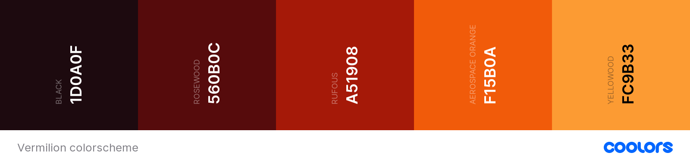

  <h1>Vermillion Theme</h1>

Vermilion is a dark theme for Visual Studio Code without blue colors in
backgrounds, the idea is to use only dark and hot colors in order to avoid
lasting contact with blue lights.
The main color scheme was inspired in the colors from the vermillion of the
sunset.

  

<!-- ### For more information
* [Visual Studio Code's Markdown Support](http://code.visualstudio.com/docs/languages/markdown)
* [Markdown Syntax Reference](https://help.github.com/articles/markdown-basics/) -->

**Enjoy!**
